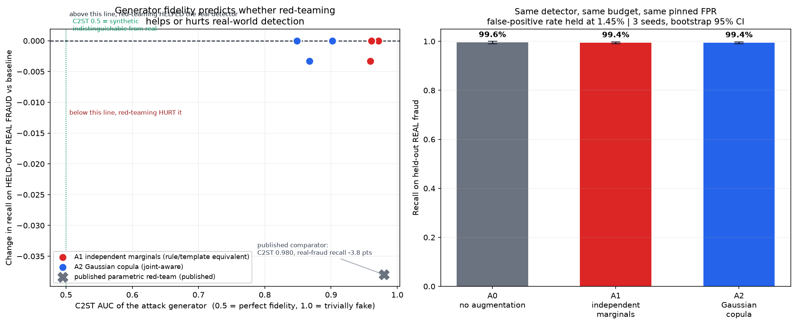
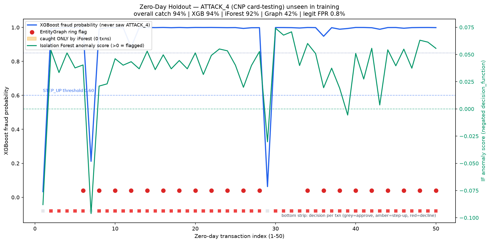

# Adversarial Payment Arena: Closed-Loop Defense Against GenAI Fraud

A full-stack, closed-loop adversarial simulation and real-time defense testbed for GenAI-driven payment fraud. Built for the **Mastercard Innovation Challenge**.

> **The thesis in one line:** a closed-loop red team *without* a fidelity gate is an attack
> surface, not a feature — folding a low-fidelity generator's escapes back into training makes
> every dashboard number improve while recall on **real** fraud falls. A label-free fidelity
> gate, computable *before* retraining, removes that failure mode. This repo doesn't assert it;
> it measures it, and every number below is regenerable with `make reproduce`.

[](https://github.com/RajvardhanPatil07/adversarial-payment-arena/actions/workflows/ci.yml)
[](LICENSE)

### Five-minute judge path
1. **Live fight** — run the stack (or open the deployed URL) and press **▶ GUIDED DEMO**: a synthetic
   mule ring is built in front of you and the narration advances only on real events (gate verdicts,
   graph ring detection, declines, final cost).
2. **The scissor** — open **/evidence**: an ungated closed loop loses **−35.8 pts** of real-fraud recall
   while gaining **+86 pts** on its own synthetic attacks; the same loop with the fidelity gate on loses
   **−0.5 pts**. That gap is the whole argument.
3. **Verify** — `make reproduce` regenerates every figure in `artifacts/` with a provenance stamp
   (git SHA, seeds, command), mapped claim-by-claim in [`artifacts/claim_ledger.json`](artifacts/claim_ledger.json).

A deeper walkthrough for evaluators lives in [`docs/JUDGES.md`](docs/JUDGES.md).

---

## Architecture Overview

The arena simulates an active fight between an autonomous **LLM Red-Team Attacker** and a **Multi-Layer Defense Decisioning Stack**, streaming live telemetry, graph mutations, and financial cost impact to a Next.js 16 SOC Dashboard over WebSockets.

```
 ┌──────────────────────────────────────────────────────────────┐
 │                  RED-TEAM ATTACKER AGENT                    │
 │        Autonomous LLM (OpenRouter / Claude / Stealth)        │
 └──────────────────────────────┬───────────────────────────────┘
                                │
                                ▼
 ┌──────────────────────────────────────────────────────────────┐
 │                      PLAUSIBILITY GATE                       │
 │    Economic Floors · Metadata Coherence · Rail Feasibility   │
 └──────────────────────────────┬───────────────────────────────┘
                                │ (Valid Transactions)
                                ▼
 ┌──────────────────────────────────────────────────────────────┐
 │                 DEFENSE DECISIONING STACK                    │
 │  1. XGBoost Velocity Model (Supervised Behavioral Scoring)   │
 │  2. Isolation Forest (Unsupervised Novelty & Anomaly Layer)  │
 │  3. NetworkX Entity Graph (Mule Ring & Topology Detection)   │
 │  4. Asymmetric Cost Matrix Optimizer ($ Block vs False Pos)  │
 └──────────────────────────────┬───────────────────────────────┘
                                │
                                ▼
 ┌──────────────────────────────────────────────────────────────┐
 │               FASTAPI WEBSOCKET STREAM ENGINE                │
 └──────────────────────────────┬───────────────────────────────┘
                                │
                                ▼
 ┌──────────────────────────────────────────────────────────────┐
 │              NEXT.js 16 SOC COMMAND DASHBOARD                │
 │   xyflow Entity Graph · Live Log Triage · Cost Matrix Analytics │
 └──────────────────────────────────────────────────────────────┘
```

---

## Key Capabilities

### 1. Autonomous LLM Red-Team Agent
- Dynamically crafts attacks constrained by real-world fraud economics (acquisition costs, target verticals, 3DS tolerances, POS entry modes).
- Operates online via **OpenRouter** (any model, set with `OPENROUTER_MODEL`; defaults to a free reasoning model, and uses `stealth/ox-alpha` when that slug is served to the account) or fully offline via a deterministic fallback fraudster — so the demo runs with **no API key**.
- Adaptive payload mutation based on real-time defense feedback and system telemetry.

### 2. Multi-Layer Defense Decisioning Stack
- **Supervised Velocity Scoring (XGBoost):** Evaluates sliding-window burst dynamics across cards, IPs, and merchant terminals.
- **Unsupervised Anomaly Detection (Isolation Forest):** Flag novel out-of-distribution patterns without requiring prior labels.
- **Graph Intelligence (NetworkX):** Real-time entity-resolution graph tracking shared infrastructure across unrelated accounts to uncover mule rings.
- **Asymmetric Cost Matrix:** Dynamically weighs False Negatives (fraud loss) vs False Positives (customer insult cost) to optimize net business impact.

### 3. Reproducible Headline: the closed-loop fidelity scissor

- **Research question:** closing an adversarial red-team loop is not, by itself, evidence that the
  loop makes a fraud detector better on real fraud. Whether it helps or hurts depends on the
  *fidelity* of the attack generator — and a label-free fidelity gate is what keeps a low-fidelity
  generator from degrading a live detector.

- **The scissor (every number emitted by `make reproduce` into `artifacts/closed_loop.json`):** an
  **ungated** loop trained on a low-fidelity generator's escapes loses **−35.8 pts** of recall on
  held-out real fraud while *gaining* **+86 pts** on the generator's own attacks — the vanity metric
  and the real metric move in opposite directions. The **same loop with the fidelity gate on** loses
  **−0.5 pts**: the gate refuses the escape batches that cause the scissor, using only a label-free
  measurement computable before retraining (**+35.3 pts** of recall protected).

  

- **Fidelity separates the generators, decisively.** C2ST AUC **0.873 (copula) vs 0.964
  (independent)** (0.5 = indistinguishable from real, 1.0 = trivially fake); rank-dependence error
  **0.795 vs 2.47** (Frobenius, lower = more realistic). The *marginal* fit is matched across arms
  (mean JSD 0.020 vs 0.021), so the entire gap is **joint structure** — the one variable under test.

- **The honest ceiling is part of the result.** On this corpus the unaugmented baseline already sits
  at **0.996 recall**, so the three-arm transfer ablation is at a ceiling: both synthetic arms show
  ~0 delta this run and the *ordering* of transfer harm is not observable. We report that ceiling
  instead of manufacturing a positive delta by handicapping the baseline. What generalises is the
  *relationship* — fidelity is measurable before deployment (C2ST / Frobenius need no fraud labels)
  and the closed loop shows it ranking real-fraud harm after. That is precisely what a pre-registered
  fidelity gate buys an issuer.

- **Economics:** at a 1.3% production base rate and 1% FPR the stack nets **≈ ₹229.3M (₹22.9Cr) per
  million authorisations** — and wrongly-declined legitimate payments are **the majority of all cost
  incurred (≈ 60%)**, which is exactly why the cost matrix is asymmetric. Precision at that base rate
  is reported honestly at **48.8%**, and the four-layer stack scores inline at **p99 15.1 ms** against
  a 100 ms authorisation budget.

- **No unverifiable hero numbers.** Every figure in this README is reachable from `make reproduce`,
  lands in `artifacts/*.json` with a provenance stamp (git SHA, seeds, command), and is mapped
  claim-by-claim in [`artifacts/claim_ledger.json`](artifacts/claim_ledger.json) / the `/evidence`
  page. A separate zero-day holdout (`make zero-day`) stress-tests an unseen attack family.

### 4. Interactive SOC Command Center
- **Next.js 16 + React 19 + Tailwind CSS v4** interface.
- **Interactive Entity Graph (@xyflow/react):** Dynamic DAG canvas highlighting compromised nodes, mule clusters, and merchant hotspots in real-time.
- **Real-Time WebSocket Ingestion:** Live streaming of attacker reasoning, plausibility checks, defense decisions, and financial cost metrics.

---

## Attack Specifications — 14 Executable Attack Families

The repository maps a 22-scenario GenAI fraud taxonomy
([`docs/ATTACK_TAXONOMY.md`](docs/ATTACK_TAXONOMY.md)); fourteen of the twenty-two
are executable. Each has a YAML spec, a generator admitted only after passing the
Plausibility Gate, and an individual detection measurement in
[`artifacts/family_coverage.json`](artifacts/family_coverage.json):

| Spec | Attack | Taxon | What it defeats |
|---|---|---|---|
| ATTACK_1 | MFA Reset via Voice Cloning (IVR takeover) | T-03 | device binding / step-up trust |
| ATTACK_2 | Synthetic Mule Ring Cash-Out | T-01 | per-account monitoring (shared device) |
| ATTACK_3 | Compromised Merchant Checkout Burst | T-18 | per-card normality |
| ATTACK_4 | CNP Card-Testing Velocity Burst | T-08 | fixed velocity rules |
| ATTACK_5 | AI-Personalised APP Scam (authorised push) | T-12 | every stolen-credential control |
| ATTACK_6 | VPA-Rental Mule Network (fan-in) | T-14 | per-account monitoring (shared payee) |
| ATTACK_7 | Synchronised Burst Cash-Out | T-17 | the independence assumption |
| ATTACK_8 | Learned Threshold Structuring | T-09 | static amount thresholds |
| ATTACK_9 | Real-time OTP-Relay Vishing | T-05 | 3DS pass treated as proof of presence |
| ATTACK_10 | 3DS Exemption-Band Abuse | T-06 | RBA exemption policy + velocity counters |
| ATTACK_11 | Delegated Agent Scope Expansion | T-19 | device binding + one-time consent |
| ATTACK_12 | Geo-Velocity Spoof with Generated Itinerary | T-11 | impossible-travel (adjacent-pair) rules |
| ATTACK_13 | Fake Merchant Shell Bust-Out (acquiring side) | T-04 | merchant onboarding document review |
| ATTACK_14 | Adversarial Decision-Boundary Probing | T-20 | the deployed scorer itself (oracle) |

Per-family recall, leave-one-family-out zero-day generalisation, and which defense
layer catches each family: `make coverage`. The eight remaining taxonomy rows name
their fields and target signals, so each is an afternoon of work, not a research
question.

---

## Project Structure

```
adversarial-payment-arena/
├── backend/
│   ├── agents/            # LLM red-team attacker agent & prompt templates
│   ├── attack_specs/      # Structured YAML attack definitions
│   ├── data/              # Synthetic generator, corpus builder & schemas
│   ├── defense/           # XGBoost, Isolation Forest, NetworkX Graph & Cost Engine
│   ├── environment/       # Payment state machine & Plausibility Gate
│   ├── evidence/          # Calibration, economics & the claim→artifact ledger
│   ├── experiments/       # Transfer-vs-fidelity ablation + zero-day holdout
│   ├── models/            # Serialized ML models (committed: xgb .json + iForest .joblib)
│   ├── schemas/           # Pydantic data schemas
│   ├── tests/             # Pytest test suite
│   ├── main.py            # FastAPI REST & WebSocket streaming server
│   └── run_campaign.py    # CLI runner for headless campaign benchmarks
├── artifacts/             # Provenance-stamped JSON evidence (via `make reproduce`)
├── docs/
│   ├── TRANSFER_LEDGER.md      # Headline fidelity-vs-transfer experiment write-up
│   ├── transfer_ledger.png     # The three-arm result figure
│   ├── ATTACK_TAXONOMY.md      # Full attack taxonomy
│   └── FEASIBILITY.md          # ISO 8583/20022 mapping & deployment path
└── frontend/
    ├── src/
    │   ├── app/           # Next.js App Router (SOC dashboard + /evidence page)
    │   ├── components/    # xyflow canvas, logs feed, cost telemetry, analyst panel
    │   └── lib/           # WebSocket client & state management
    └── package.json
```

---

## Quick Start

### Prerequisites
- **Python 3.11+**
- **Node.js 20+** & **pnpm**
- *(Optional)* `OPENROUTER_API_KEY` for live LLM attacker reasoning

### 1. Backend Setup

```bash
cd backend

# Create & activate virtual environment
python3 -m venv .venv
source .venv/bin/activate

# Install dependencies
pip install -r requirements.txt

# Run automated test suite
pytest tests/

# (Optional) retrain + re-serialize the defense models into backend/models/.
# The repo already ships trained models, so this is only needed if you change
# the corpus or feature pipeline. Run from the repo root:
#   make models

# Start FastAPI server (Port 8000)
uvicorn main:app --reload --port 8000
```

> The two serialized detectors (`backend/models/xgb_model.json`, `iforest_model.joblib`) are **committed**, so a fresh clone demos a working four-layer defense with **no build and no API key**.

### 2. Frontend Setup

```bash
cd frontend

# Install dependencies
pnpm install

# Start development server (Port 3000)
pnpm dev
```

Open [http://localhost:3000](http://localhost:3000) to view the SOC dashboard.

### 3. Deploy as a single URL (recommended for judging)

The `Dockerfile` builds the UI to static assets and serves them from the same FastAPI origin as the
WebSocket — one URL, one process, no CORS or mixed-content surface. A judge opens one link and the
whole arena works. Deploy to whichever platform you have an account on:

```bash
# Fly.io (keeps one warm instance so the first click is instant)
fly launch --no-deploy --copy-config && fly deploy && fly open

# or Render
# use the provided render.yaml blueprint
```

The same image runs locally for a rehearsal: `docker build -t arena . && docker run -p 8000:8000 arena`.

---

## Running Campaigns & Experiments

### Headless Campaign Execution
```bash
# Offline (no key): the mule-ring campaign visibly forms a ring and gets DECLINED.
python backend/run_campaign.py --attack attack_2_synthetic_mule_ring --size 25 --fast
python backend/run_campaign.py --attack attack_1 --size 50
```

### Regenerate the full evidence set (headline experiment + economics)
```bash
make reproduce        # calibration + fidelity + transfer ablation -> artifacts/*.json
```

### Zero-Day Holdout Experiment Benchmark
```bash
make zero-day         # or: python backend/experiments/zero_day_holdout.py
```

---

## How this compares

| | This repo | Published comparable submission | Commercial vendor category | Typical hackathon demo |
|---|---|---|---|---|
| Red-team visible end-to-end | Yes — attacker reasoning, gate verdicts, decisions, cost, live | Partial | No (black-box) | Rarely |
| Measures closed-loop harm on *real* fraud | Yes — the scissor, gated vs ungated | Reported a **−3.8 pt** real-recall loss from ungated hardening (C2ST 0.980) | Not published | Not measured |
| Fidelity gate before retraining | Yes, label-free | Concluded a learned generative model was needed | Proprietary | Absent |
| Every headline number reproducible | `make reproduce` + claim ledger | Partial | No | Unverifiable hero numbers |
| Honest negatives reported | Yes (recall ceiling stated plainly) | — | No incentive | No incentive |

The transfer ablation and zero-day holdout figures, for reference:




---

## License

MIT License. Developed for research and demonstration in payment security.

