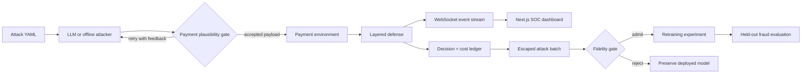
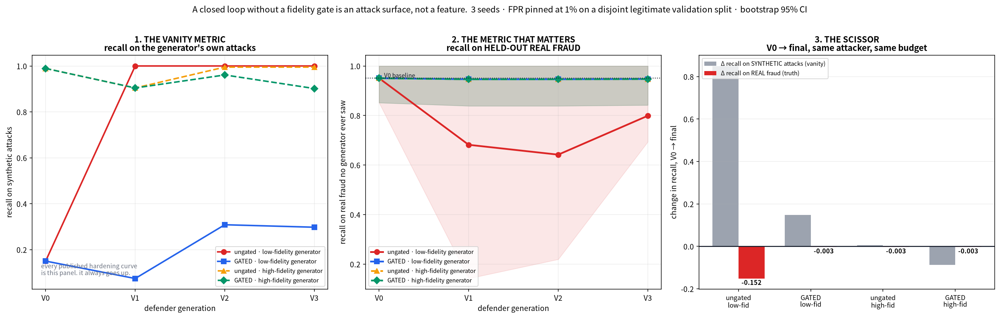

<div align="center">

# Adversarial Payment Arena

### A live, closed-loop testbed for attacking—and safely improving—payment-fraud defenses

An adaptive red-team agent generates payment attacks, a layered defense scores them in real time,
and a label-free fidelity gate decides whether escaped attacks are safe enough to learn from.

[](https://adversarial-payment-arena.onrender.com)
[](https://github.com/RajvardhanPatil07/adversarial-payment-arena/actions/workflows/ci.yml)
[](https://www.python.org/)
[](https://nextjs.org/)
[](LICENSE)

**[Open the live arena](https://adversarial-payment-arena.onrender.com)** ·
**[Run locally](#quick-start)** ·
**[Review the evidence](#reproducible-evidence)** ·
**[90-second judge path](docs/JUDGES.md#90-second-judge-path)**

</div>

> A red-team loop can improve recall on its own synthetic attacks while quietly reducing recall on
> held-out fraud. This project makes that failure visible—and tests a gate that prevents it before
> retraining.

## Why this exists

Most fraud demos stop after showing that a detector catches generated attacks. Adversarial Payment
Arena asks a harder question: **does learning from those attacks improve the detector, or teach it
the generator's artifacts?**

The repository combines four things that are usually evaluated separately:

- an adaptive attacker that observes feedback and changes tactics;
- a real-time defense using supervised, unsupervised, graph, and cost-aware signals;
- held-out fraud evaluation across closed-loop generations; and
- a pre-retraining fidelity gate that does not need new fraud labels.

Every headline result is generated by a seeded experiment, written to `artifacts/`, and stamped
with its command, Python version, seeds, and git revision.

## How the arena works



The two gates have different jobs:

| Gate | Runs when | Protects against |
|---|---|---|
| **Payment plausibility gate** | Before a generated transaction enters the simulated payment stack | Impossible or internally inconsistent attack payloads |
| **Fidelity gate** | After escapes are collected, before any retraining | Synthetic batches whose joint distribution is too unlike known fraud |

For every accepted payload, the server emits an ordered stream:
`payload_generated → defense_decision → cost_update → graph_update`.

## Quick start

### Prerequisites

- Python 3.12
- Node.js 24
- pnpm 11.22.0

No API key is required. Without an OpenRouter key, the attacker automatically uses the deterministic
offline strategy.

### Run the dashboard locally

```bash
git clone https://github.com/RajvardhanPatil07/adversarial-payment-arena.git
cd adversarial-payment-arena

# Backend
python3.12 -m venv backend/.venv
source backend/.venv/bin/activate
python -m pip install -r backend/requirements.txt

# Frontend
cd frontend
pnpm install --frozen-lockfile
cd ..
```

Start the two processes in separate terminals:

```bash
# Terminal 1 — FastAPI on http://localhost:8000
source backend/.venv/bin/activate
make serve

# Terminal 2 — Next.js on http://localhost:3000
make ui
```

Open [http://localhost:3000](http://localhost:3000), choose an attack, and press **Guided demo**.

### Run a campaign without the UI

```bash
source backend/.venv/bin/activate
python backend/run_campaign.py --attack attack_2 --size 25 --fast
```

The command prints newline-delimited JSON, so it can be inspected or piped into another tool:

```bash
python backend/run_campaign.py --attack attack_1 --size 10 --fast | jq
```

### Run everything in one container

The production image exports the Next.js UI and serves it from FastAPI alongside REST and
WebSocket routes. This keeps the demo on one origin and avoids CORS and mixed-content failures.

```bash
docker build -t adversarial-payment-arena .
docker run --rm -p 8000:8000 adversarial-payment-arena
```

Then open [http://localhost:8000](http://localhost:8000).

## The core experiment: the fidelity scissor

The closed-loop experiment runs the same detector and fixed attack budget for three generations.
It compares low- and high-fidelity escape generators with the fidelity gate enabled and disabled.



| Experiment arm | Δ recall on generated attacks | Δ recall on held-out fraud | Gate outcome |
|---|---:|---:|---|
| Low fidelity, **ungated** | **+85.7 pts** | **−35.8 pts** | Not applied |
| Low fidelity, **gated** | +5.3 pts | **−0.5 pts** | Rejected all 3 generations in all seeds |
| High fidelity, ungated | +0.8 pts | −0.5 pts | Not applied |
| High fidelity, gated | −2.8 pts | −0.5 pts | Rejected 0, 2, and 0 batches by seed |

The low-fidelity ungated arm creates the scissor: the synthetic benchmark improves while held-out
recall collapses. The gate protects **35.3 percentage points** of held-out recall by refusing those
escape batches before training.

The gate uses two fixed, label-free thresholds:

| Measurement | Reject when | Interpretation |
|---|---:|---|
| Classifier two-sample test (C2ST) AUC | `> 0.90` | A classifier can too easily distinguish synthetic escapes from known fraud |
| Rank-dependence Frobenius error | `> 1.50` | Relationships between features are too unlike known fraud |

See [`artifacts/closed_loop.json`](artifacts/closed_loop.json) for seed-level values, confidence
intervals, thresholds, and provenance.

## Defense stack

Each transaction is evaluated inline by complementary signals:

| Layer | Implementation | Purpose |
|---|---|---|
| Supervised risk | XGBoost model | Learns known fraud patterns |
| Unsupervised novelty | Isolation Forest | Flags behavior unlike legitimate training traffic |
| Entity topology | NetworkX graph | Detects shared devices, IPs, merchants, and coordinated rings |
| Decision policy | Asymmetric cost matrix | Converts risk into approve, review, step-up, or decline actions |

The dashboard combines attacker reasoning, plausibility feedback, transaction verdicts, entity-graph
changes, and a running false-positive/false-negative cost ledger.

## Attack library

Fourteen attack families are executable from YAML specs in
[`backend/attack_specs/`](backend/attack_specs). The broader 22-scenario taxonomy is documented in
[`docs/ATTACK_TAXONOMY.md`](docs/ATTACK_TAXONOMY.md).

| ID | Scenario | Primary control under pressure |
|---|---|---|
| 1 | MFA reset via voice cloning | Device binding and step-up trust |
| 2 | Synthetic mule-ring cash-out | Per-account monitoring |
| 3 | Compromised merchant checkout burst | Per-card normality |
| 4 | CNP card-testing velocity burst | Fixed velocity rules |
| 5 | AI-personalized APP scam | Stolen-credential controls |
| 6 | VPA-rental mule network | Shared-payee monitoring |
| 7 | Synchronized burst cash-out | Independence assumptions |
| 8 | Learned-threshold structuring | Static amount thresholds |
| 9 | Real-time OTP-relay vishing | 3DS interpreted as presence proof |
| 10 | 3DS exemption-band abuse | RBA exemptions and velocity counters |
| 11 | Delegated-agent scope expansion | One-time consent boundaries |
| 12 | Geo-velocity spoofing with itinerary | Adjacent-pair impossible-travel rules |
| 13 | Fake merchant shell bust-out | Merchant onboarding review |
| 14 | Adversarial boundary probing | The deployed scorer itself |

## Reproducible evidence

Activate the backend virtual environment, then regenerate the complete headline evidence set:

```bash
make reproduce
```

| Command | Output | Question answered |
|---|---|---|
| `make calibration` | `calibration_audit.json` | Were thresholds chosen without evaluation leakage? |
| `make fidelity` | `fidelity_report.json` | How realistic are the synthetic generators? |
| `make transfer` | `transfer_ledger.json`, `metrics.json`, `prevalence_metrics.json`, `economics.json` | Does synthetic performance transfer, and at what cost? |
| `make closed-loop` | `closed_loop.json` | Does gating prevent harmful retraining? |
| `make coverage` | `family_coverage.json` | How does each attack family perform when known or withheld? |
| `make latency` | `latency.json` | Can the full decision path fit an inline authorization budget? |

Useful verification commands:

```bash
make test             # backend tests
make check            # compile every backend module
make artifacts        # list generated evidence
make clean-artifacts  # remove generated JSON before a clean reproduction
```

Current committed evidence reports:

| Measure | Result |
|---|---:|
| Executable attack families | 14 |
| Mean recall, family included in supervised training | 90.9% |
| Mean recall, family withheld as zero-day | 84.1% |
| Inline decision latency | p50 6.73 ms · p95 7.45 ms · p99 9.09 ms |
| Net benefit at 1M authorizations and 1.3% fraud prevalence | ₹22.93 Cr |

Claims shown in the UI map to artifact fields through
[`artifacts/claim_ledger.json`](artifacts/claim_ledger.json). The `/evidence` page renders the same
committed JSON that reviewers can inspect and regenerate locally.

## API and WebSocket protocol

The backend exposes these primary endpoints:

| Method | Path | Purpose |
|---|---|---|
| `GET` | `/api/health` | Readiness, model sources, event count, and running costs |
| `GET` | `/api/merchants` | Simulated merchant registry |
| `GET` | `/api/attacks` | Available attack specifications |
| `POST` | `/api/load_attack` | Load and validate one attack spec |
| `GET` | `/api/graph/snapshot` | Current entity graph |
| `GET` | `/api/evidence/index` | Artifact inventory and reproduction commands |
| `GET` | `/api/evidence/summary` | Headline evidence summary |
| `GET` | `/api/evidence/claims` | Claim-to-artifact mapping |
| `GET` | `/api/evidence/artifact/{name}` | Allow-listed raw artifact JSON |
| WebSocket | `/ws` | Real-time campaign control and events |

Start a WebSocket campaign with:

```json
{
  "type": "start_campaign",
  "attack_file": "attack_2",
  "campaign_size": 25
}
```

Campaign sizes are clamped to `1..200`, and only one campaign mutates the shared arena at a time.

## Configuration

| Variable | Required | Description |
|---|---|---|
| `OPENROUTER_API_KEY` | No | Enables the live LLM attacker and local analyst route; offline attacker is the fallback |
| `OPENROUTER_MODEL` | No | Overrides the default OpenRouter model |
| `OPENROUTER_BASE_URL` | No | Overrides the OpenRouter-compatible API base URL |
| `ALLOWED_ORIGINS` | No | Comma-separated extra origins accepted by FastAPI |
| `NEXT_PUBLIC_BACKEND_URL` | No | Backend origin when the frontend runs separately |
| `NEXT_PUBLIC_BACKEND_WS_URL` | No | Explicit WebSocket URL for split deployments |
| `SERVE_STATIC_DIR` | No | Exported frontend directory served by FastAPI |

## Project structure

```text
adversarial-payment-arena/
├── backend/
│   ├── agents/          # adaptive LLM/offline attacker
│   ├── attack_specs/    # 14 executable YAML attack families
│   ├── data/            # legitimate/fraud corpus generation
│   ├── defense/         # supervised, novelty, graph, and policy layers
│   ├── environment/     # payment world and plausibility checks
│   ├── evidence/        # calibration, economics, privacy, artifact ledger
│   ├── experiments/     # reproducible experiment entry points
│   ├── models/          # committed serialized detectors
│   ├── tests/           # backend test suite
│   ├── main.py          # FastAPI REST + WebSocket application
│   └── run_campaign.py  # headless campaign CLI
├── frontend/src/
│   ├── app/             # arena and evidence routes
│   ├── components/      # dashboard, feeds, graph, and control panels
│   └── lib/             # API/WebSocket clients and shared types
├── artifacts/           # provenance-stamped JSON results
├── docs/                # methodology, taxonomy, judge guide, and figures
├── Makefile             # development and evidence commands
├── Dockerfile           # single-origin production image
├── render.yaml          # Render deployment blueprint
└── fly.toml              # Fly.io deployment configuration
```

## Deployment

Both deployment configurations build the same single-container image:

- [`render.yaml`](render.yaml) deploys the public demo on Render.
- [`fly.toml`](fly.toml) provides a Fly.io alternative with a persistent WebSocket-capable process.

The health checks call `/api/health`, which only becomes ready after the serialized models load.

## Scope and limitations

- The held-out fraud is simulated, topology-aware arena fraud—not issuer production traffic.
- Three seeds are used per closed-loop arm; confidence intervals are reported in the artifacts.
- Leave-one-family-out removes a family from supervised training, while unsupervised layers still
  train only on legitimate traffic.
- Latency measurements are single-threaded and exclude network transport and ISO message parsing.
- Absolute fraud metrics in a synthetic environment are directional. The primary result is the
  measured relationship between generator fidelity, transfer harm, and gating.

## Further reading

- [`docs/JUDGES.md`](docs/JUDGES.md) — concise demo and evaluation path
- [`docs/ATTACK_TAXONOMY.md`](docs/ATTACK_TAXONOMY.md) — 22-scenario GenAI fraud taxonomy
- [`docs/TRANSFER_LEDGER.md`](docs/TRANSFER_LEDGER.md) — transfer methodology and claims
- [`docs/ZERO_DAY_EXPERIMENT.md`](docs/ZERO_DAY_EXPERIMENT.md) — holdout experiment
- [`docs/FEASIBILITY.md`](docs/FEASIBILITY.md) — production-feasibility discussion

## License

Released under the [MIT License](LICENSE). Built for payment-security research and demonstration.
